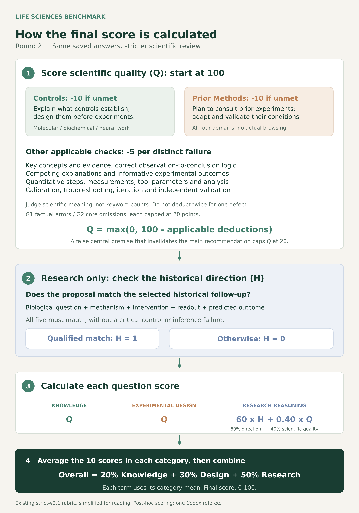
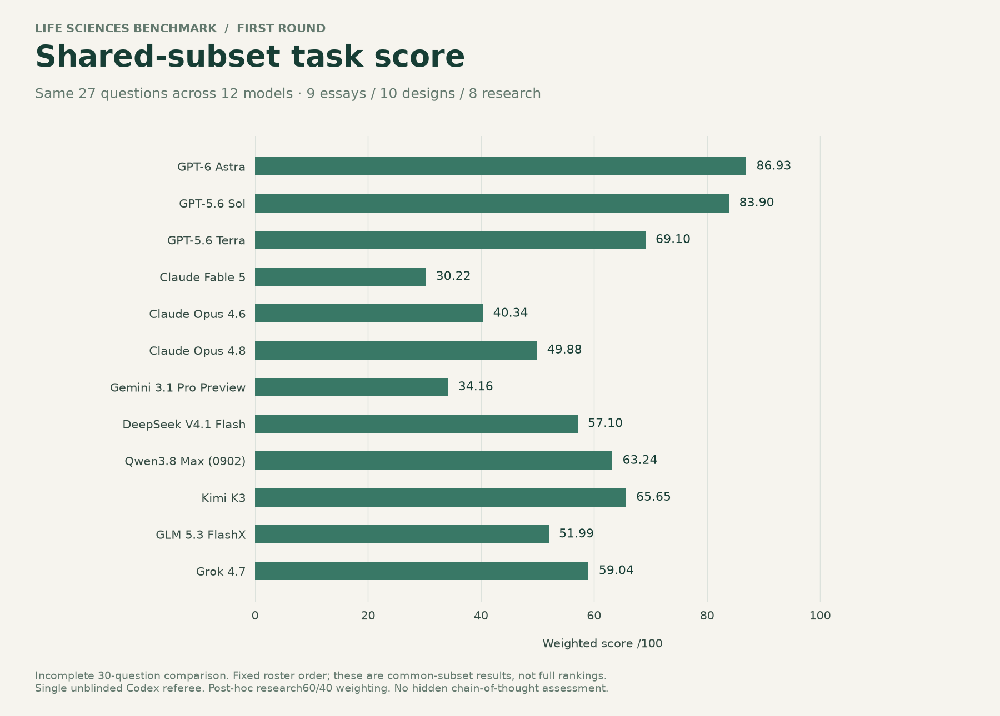
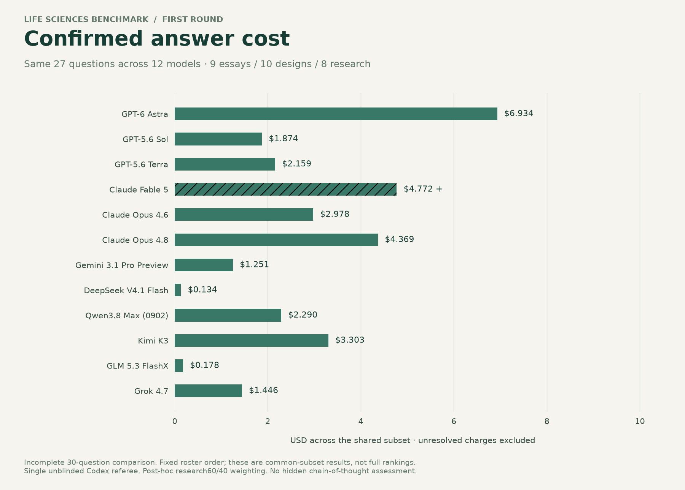
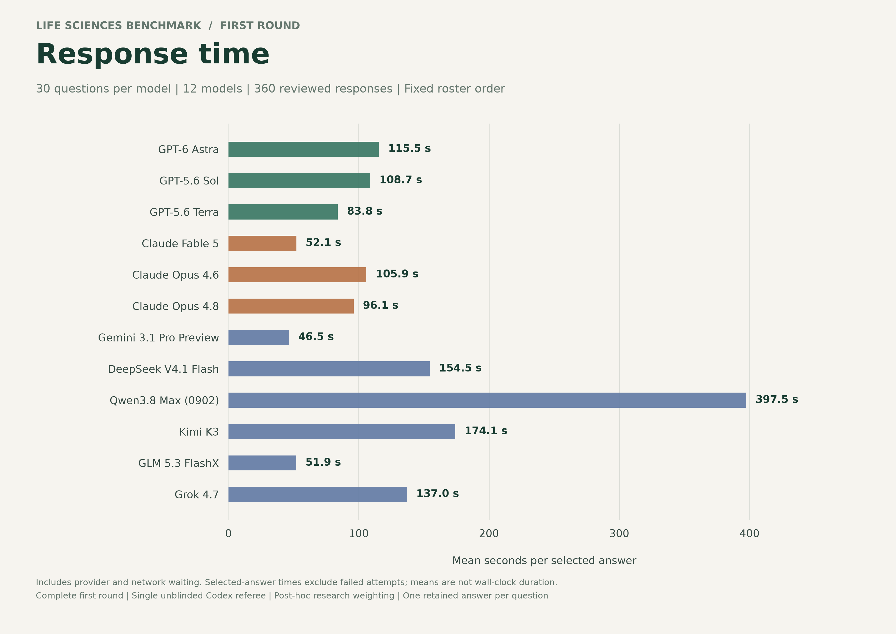
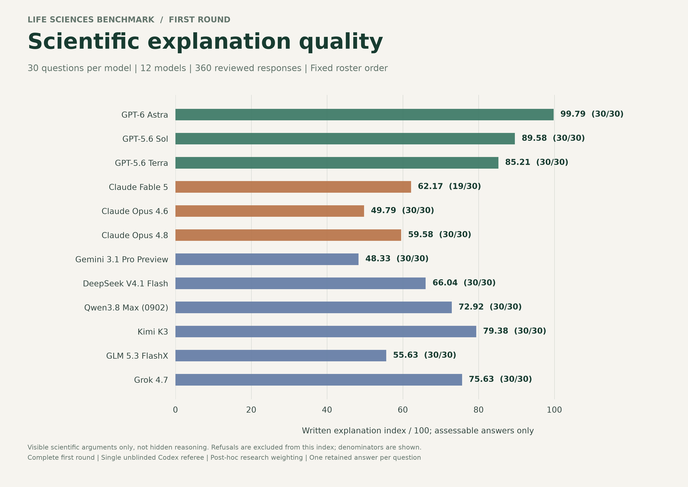
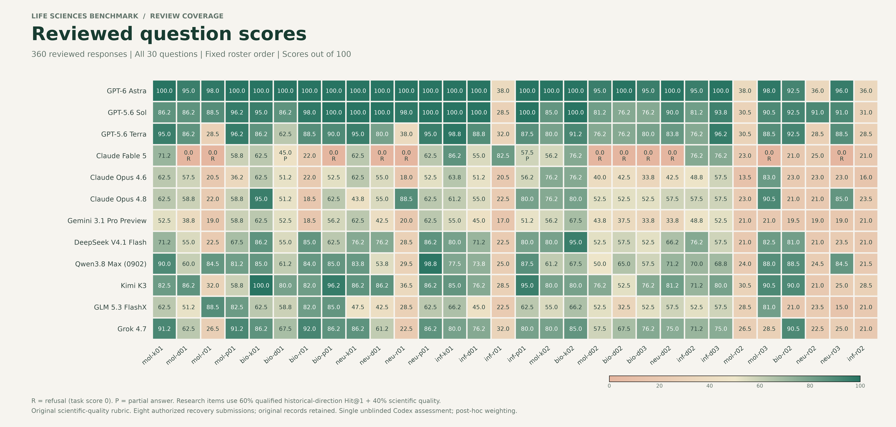
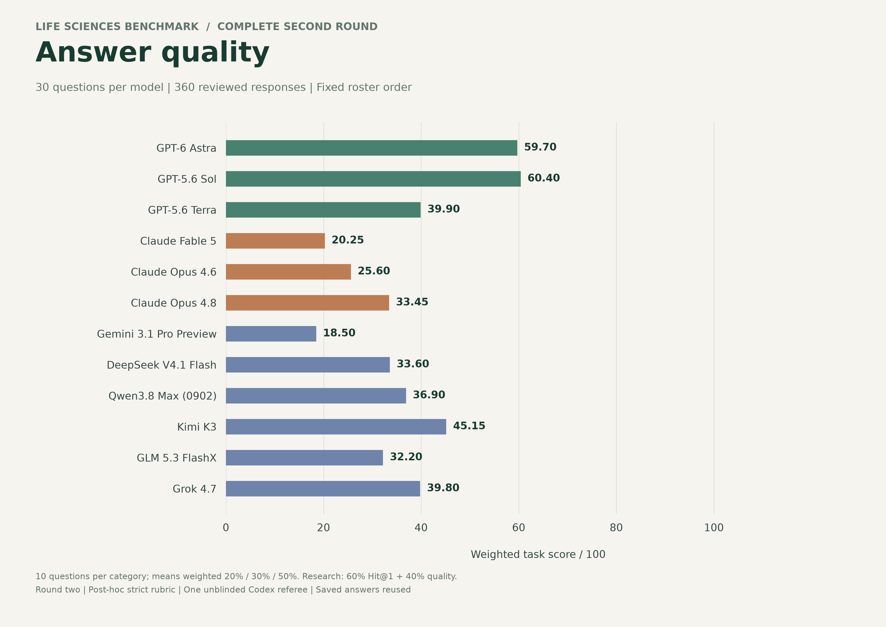
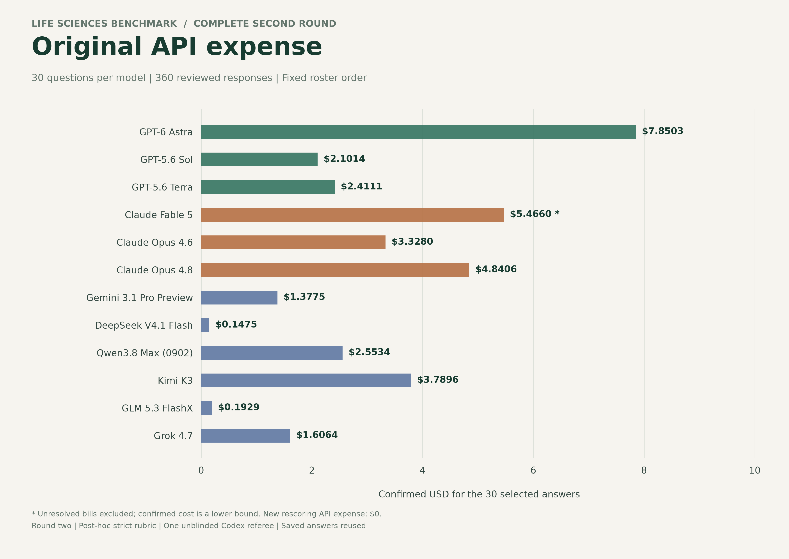
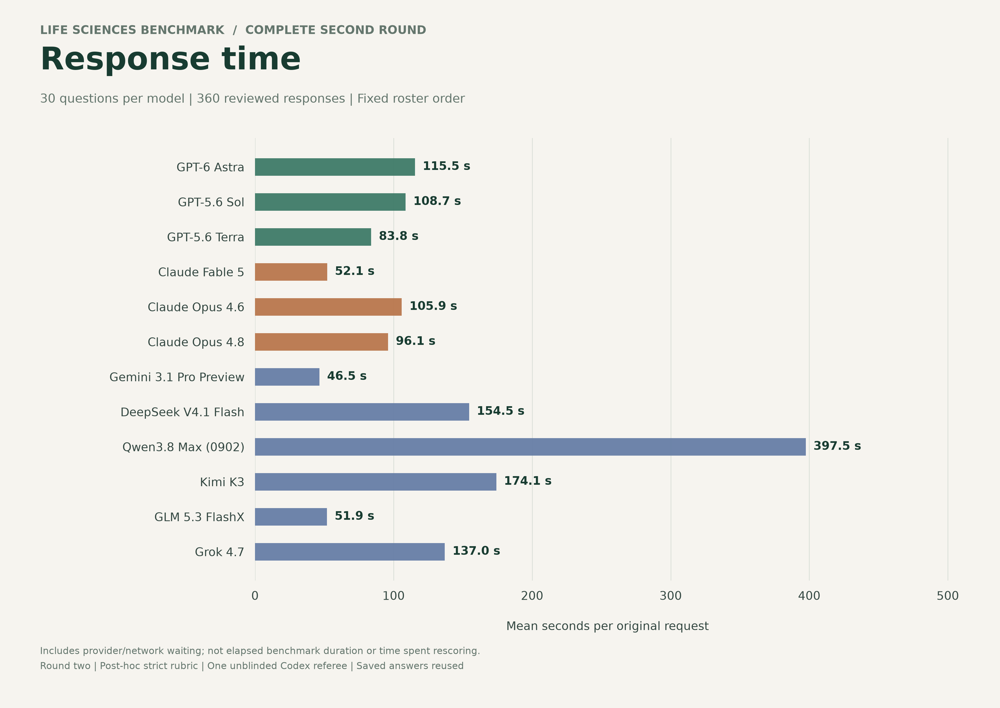
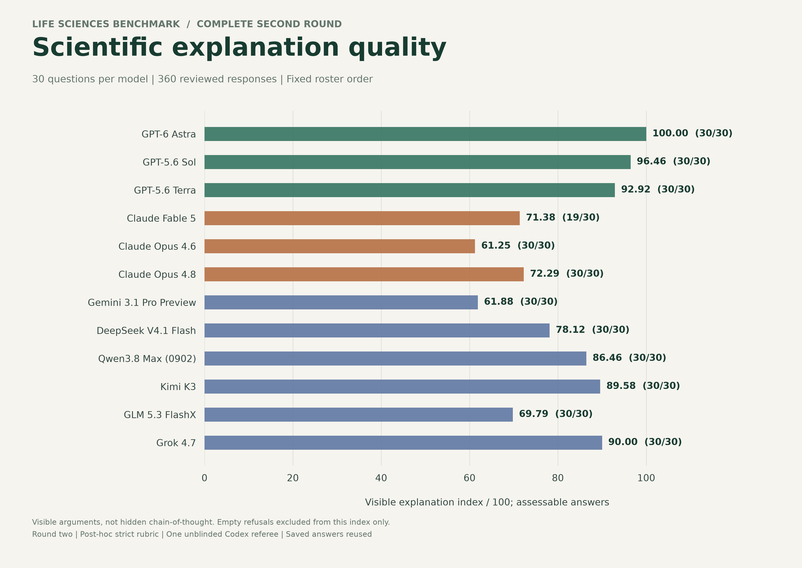

# Life Sciences Research Benchmark



[High-resolution diagram](docs/assets/scoring-standard-readable-v2.png) | [SVG](docs/assets/scoring-standard-readable-v2.svg) | [PDF](docs/assets/scoring-standard-readable-v2.pdf)

The diagram describes the strict second-round rubric. First-round scoring uses the original dimension-weighted rubric; both processes and all review records are [open for inspection](evaluation-audit/README.md).

Evaluate whether AI models can help life-science researchers ask valuable biological questions, design rigorous experiments and develop sound research directions from data.

**Current comparison:** **12 models, 30 questions each, 360 responses**, assessed in two scoring rounds using the same saved answers. Each round reports results under its own scientific-quality rubric:

- **Round 1 - weighted quality assessment:** scientific accuracy (35%), decision value (25%), actionability (20%), verifiability (15%) and communication (5%). Each dimension is rated from 0 to 4. [Scoring criteria](benchmark-30/v1/RUBRIC.md) | [Round 1 results](docs/first-round-20261003/SCORECARD.md).
- **Round 2 - detailed experimental and reasoning assessment:** scientific quality starts at 100, with 10-point deductions for unmet control-design and prior-Methods requirements, and 5-point deductions for distinct applicable failures in scientific content, reasoning, quantitative procedures, analysis and troubleshooting. Applicability, caps and non-duplication rules are specified in the rubric. [Scoring criteria](benchmark-30/v2/RUBRIC.md) | [Round 2 results](docs/second-round-20261004/SCORECARD.md).

Both rounds use the same category weights: 20% knowledge, 30% experimental design and 50% research reasoning. Research-question scores combine 60% qualified historical-direction matching with 40% scientific quality under the respective rubric. Both sets of results are retained for comparison; the [open question set](benchmark-30/README.md) includes the questions and both reference-answer versions.

## First-round results

| Model | Essay | Design | Research | Total /100 |
|---|---:|---:|---:|---:|
| GPT-6 Astra | 100.00 | 98.00 | 73.25 | **86.03** |
| GPT-5.6 Sol | 96.25 | 87.12 | 73.95 | **82.36** |
| GPT-5.6 Terra | 91.50 | 80.62 | 54.40 | **69.69** |
| Claude Fable 5 | 59.38 | 25.25 | 19.45 | **29.17** |
| Claude Opus 4.6 | 60.12 | 48.00 | 26.25 | **39.55** |
| Claude Opus 4.8 | 68.25 | 55.00 | 41.55 | **50.92** |
| Gemini 3.1 Pro Preview | 58.50 | 42.88 | 19.50 | **34.31** |
| DeepSeek V4.1 Flash | 78.50 | 62.00 | 40.85 | **54.73** |
| Qwen3.8 Max (0902) | 81.75 | 63.12 | 55.40 | **62.99** |
| Kimi K3 | 85.00 | 76.62 | 46.45 | **63.21** |
| GLM 5.3 FlashX | 65.25 | 50.25 | 41.15 | **48.70** |
| Grok 4.7 | 85.25 | 69.00 | 38.70 | **57.10** |

[All first-round reviews](evaluation-audit/round-one/reviews) | [Scores and provenance](docs/first-round-20261003/SCORECARD.md)

The four charts compare the same 30 questions for every model. Essay, design and research category means carry 20/30/50 weights. Research items combine 60% qualified historical-direction hit and 40% scientific quality, under the documented post-hoc amendment. Provider colors are green for OpenAI, copper for Anthropic and slate blue for other providers; colors do not affect scoring.

| Answer quality | API expense |
|---|---|
|  |  |
| Response time | Scientific explanation quality |
|  |  |

**360 question scores:** R marks a refusal; P marks a partial answer. Research cells already include the 60/40 direction/quality weighting.



[Four-chart high-resolution overview](docs/first-round-20261003/four-metric-overview.png) · [Scalable overview](docs/first-round-20261003/four-metric-overview.svg) · [Scalable heatmap](docs/first-round-20261003/reviewed-item-scores.svg) · [Metrics CSV](docs/first-round-20261003/model-summary.csv)

Confirmed run charges are **$35.6704**, with **16 unresolved bills** excluded. Means include provider/network waiting; they are not wall-clock completion times. Explanation scores concern visible scientific arguments, not hidden reasoning; Fable's mean uses 19 assessable answers out of 30. These are exploratory results from one unblinded Codex referee, not an independently validated leaderboard.

## Second-round results

[All second-round reviews](evaluation-audit/round-two/reviews) | [Exact deduction evidence](evaluation-audit/round-two/checks.csv)

Scores use 20% essay, 30% experimental-design and 50% research-reasoning category means. Each research item combines 60% qualified historical-direction Hit@1 and 40% strict scientific quality. The rubric and direction weighting are post-hoc; scoring was performed by one unblinded Codex referee. A valid alternative research direction can receive quality credit without matching the selected historical continuation.

| Model | Essay | Design | Research | Total /100 | Direction hits /10 |
|---|---:|---:|---:|---:|---:|
| GPT-6 Astra | 72.50 | 60.00 | 54.40 | **59.70** | 5 |
| GPT-5.6 Sol | 70.00 | 59.00 | 57.40 | **60.40** | 6 |
| GPT-5.6 Terra | 71.50 | 45.00 | 24.20 | **39.90** | 1 |
| Claude Fable 5 | 50.00 | 12.50 | 13.00 | **20.25** | 1 |
| Claude Opus 4.6 | 53.00 | 25.00 | 15.00 | **25.60** | 1 |
| Claude Opus 4.8 | 60.00 | 34.50 | 22.20 | **33.45** | 2 |
| Gemini 3.1 Pro Preview | 52.00 | 17.00 | 6.00 | **18.50** | 0 |
| DeepSeek V4.1 Flash | 67.50 | 36.00 | 18.60 | **33.60** | 1 |
| Qwen3.8 Max (0902) | 64.50 | 34.00 | 27.60 | **36.90** | 2 |
| Kimi K3 | 67.50 | 52.50 | 31.80 | **45.15** | 2 |
| GLM 5.3 FlashX | 60.00 | 28.00 | 23.60 | **32.20** | 2 |
| Grok 4.7 | 66.50 | 50.00 | 23.00 | **39.80** | 1 |

[Full results and original cost/time metrics](docs/second-round-20261004/SCORECARD.md) | [Model metrics CSV](docs/second-round-20261004/model-summary.csv) | [All 360 item scores](docs/second-round-20261004/item-scores.csv)

Model order follows the frozen roster. All selected answer hashes, 7,560 checklist records and score calculations passed consistency checks. Second-round API expense: **$0**. The charts below show the second-round results; the first-round results and charts are presented above.

## Second-round visual summary

| Answer quality | Original API expense |
|---|---|
|  |  |
| Response time | Scientific explanation quality |
|  |  |


[Four-chart high-resolution overview](docs/second-round-20261004/four-metric-overview.png) | [Scalable overview](docs/second-round-20261004/four-metric-overview.svg) | [All figures as PDF](docs/second-round-20261004/second-round-figure-collection.pdf)

PNG exports are 300 DPI; SVG and PDF versions preserve vector detail. Provider colors match the first round. R marks an empty refusal; P marks a partial answer. Other zero scores are rubric outcomes. Expense is from original selected answers, with unresolved bills excluded; rescoring added $0 in candidate/judge API charges.

## Open scoring records and process

Both rounds are fully inspectable: **720 reviews**, the **360 final answers** used in both rounds, and all **7,560 second-round check decisions**. Browse [answers and reviews by model](evaluation-audit/README.md), read the [scoring process](evaluation-audit/PROCESS.md), or [recompute both rounds](evaluation-audit/verify_scores.py). Original and amended review snapshots are preserved; this release changes no score.

## Open questions, references and scoring

[Read all 30 questions](benchmark-30/QUESTIONS.md) and follow each question's links to its original and revised reference answers. The [reference revision log](benchmark-30/v2/REFERENCE-CHANGES.md) records scientific corrections and added execution detail. The [first rubric](benchmark-30/v1/RUBRIC.md) remains available alongside the [second-round rubric](benchmark-30/v2/RUBRIC.md). New reference revisions await owner review; the confirmed human review applies to the original versions.

[Scoring workflow](docs/assets/scoring-standard-readable-v2.svg)

## Benchmark purpose

This benchmark evaluates whether AI models can make a useful contribution to life-science research. It focuses on the ability to:

- **Ask valuable biological questions:** identify an important unresolved mechanism and formulate a specific, testable question.
- **Design complete experiments:** connect the question to appropriate methods, controls, quantitative readouts and analysis.
- **Work through experimental details:** specify conditions, calibration and practical steps; anticipate failed experiments, incorrect hypotheses and alternative outcomes.
- **Develop research questions from data:** distinguish supported findings from speculation and propose informative next experiments or analyses.

The goal is to help researchers identify which models can support their work, from interpreting an observation to planning a study and deciding what to investigate next.

## Research areas and question topics

Questions use methods common in **molecular biology, biochemistry, neurobiology and bioinformatics** to investigate concrete biological problems. The four areas describe the main experimental or analytical approach; individual questions can connect several areas.

| Research area | Topics in the 30 evaluated questions | Experimental and analytical approaches |
|---|---|---|
| Molecular biology | Pyroptosis and gasdermin D membrane injury; DNA damage response, RAD9 checkpoints and p53-dependent cell-cycle arrest; kinase activity versus scaffolding; protein interactions and antibody specificity | Knockout, acute depletion and rescue; domain and mutant analysis; immunoblotting and co-immunoprecipitation; purified-protein membrane reconstitution; cell-cycle and cell-death measurements |
| Biochemistry | Enzyme kinetics and inhibition; reporter interference; yeast fermentation and separable cofactors; TCA-cycle intermediate recycling; F1-ATPase rotation and mechanochemical coupling | Initial-rate measurements; orthogonal enzyme assays; fractionation and reconstitution; isotope tracing and carbon balance; single-molecule rotation and ATP measurements |
| Neurobiology | Memory engrams and associative learning; projection-specific circuit function; calcium signals versus spiking; visual-cortex development; dopamine reward prediction and uncertainty | Activity-dependent labeling; optogenetic perturbation; behavioral controls; simultaneous calcium imaging and electrophysiology; receptive-field mapping and controlled reward schedules |
| Bioinformatics | GWAS-to-gene inference; RNA-seq differential expression and effect-size shrinkage; tumor multiomics; single-cell RNA/protein integration; pseudoreplication and rare-variant burden analysis | Fine mapping and colocalization; count models and multiple-testing control; batch-aware integration; donor-level or hierarchical analysis; parameter sensitivity, held-out validation and reproducible figure generation |

The questions span **knowledge essays, experimental design and research reasoning**. Models receive fixed evidence packets and answer without browsing or external tools. Computational questions assess proposed analysis and interpretation; this comparison does not include executing pipelines on raw data.

[Browse the 30 questions and their evidence packets](benchmark-30/QUESTIONS.md)

## Status

The broader question bank currently contains **128 questions**. **30 questions have been refined for the completed comparison**; API costs limited testing to this subset. More questions are in preparation.

- **Completed evaluation:** 12 models, 30 questions per model and one answer per question, producing 360 responses.
- **Two scoring rounds:** both sets of results are available, showing how the same responses perform under the original weighted rubric and the stricter checklist rubric.
- **Open materials:** all 30 evaluated questions, both reference-answer versions, both rubrics, 720 reviews and the score-verification script are published.
- **Review status:** the owner reviewed the original questions and reference answers. Revised second-round references await owner review.

The current results use a single Codex referee. The stricter rubric and 60/40 research-direction weighting were introduced after answers were available. See the [scoring process](evaluation-audit/PROCESS.md) for the complete method and the [evaluation record](docs/CURRENT_EVALUATION.md) for version history.

## Install and verify

Requires **Python 3.11+** and Git. Clone the repository:

```console
git clone https://github.com/Sculptor815/life-sciences-research-benchmark.git
cd life-sciences-research-benchmark
```

To verify the published results, run:

```console
python evaluation-audit/verify_scores.py
```

This checks the published file hashes, evidence quotations and score calculations for both rounds. It uses the Python standard library and makes no API calls.

To install the evaluation runner and review interface, create a virtual environment and install the package:

**Windows PowerShell**

```powershell
python -m venv .venv
.\.venv\Scripts\python.exe -m pip install -e ".[runtime,review]"
```

**macOS / Linux**

```sh
python3 -m venv .venv
.venv/bin/python -m pip install -e ".[runtime,review]"
```

The `runtime` extra installs Inspect AI for provider calls; `review` installs Streamlit for the review interface. For runner configuration and review queues, see the [setup guide](docs/QUICKSTART.md). Its bundled example dataset is separate from the published 30-question comparison.

## Documentation and contributing

- [Questions, reference answers and rubric versions](benchmark-30/README.md)
- [Scoring process, individual reviews and reproducibility](evaluation-audit/README.md)
- [Question authoring and review](docs/AUTHORING.md)
- [Researcher needs](docs/USER_NEEDS.md)
- [Paper-integrity cases](docs/DISPUTED_PAPERS.md) and [raw-data reproduction protocol](docs/REPRODUCTION.md)

Feedback on biological questions, experimental controls, reference answers and scoring decisions is welcome through GitHub issues. Include the question ID and, for a scoring concern, the model and the specific evidence or criterion involved.

## License

Code: MIT. Original questions and synthetic figures: CC BY 4.0, attributed to Life Sciences Research Benchmark contributors. External sources retain their own licenses.
