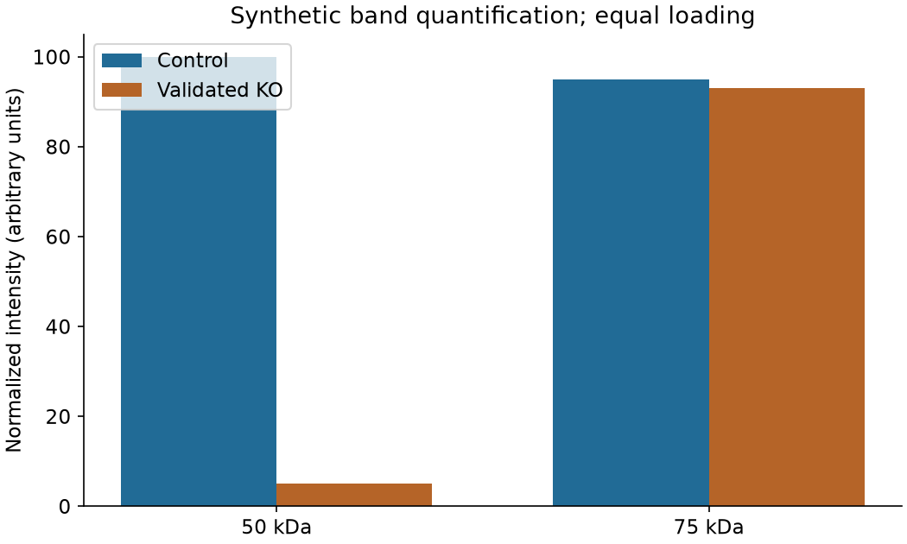
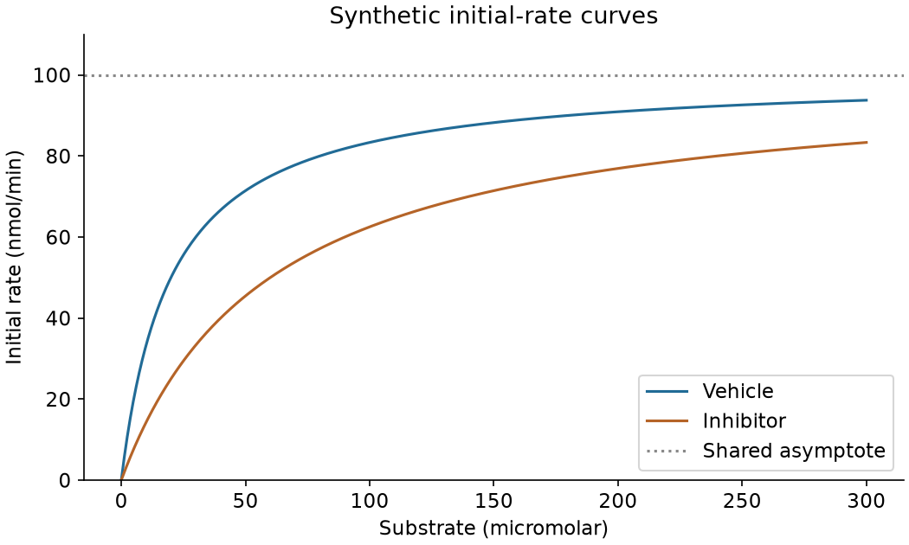

# The 30 evaluated questions

Exact prompts and evidence packets used in the completed first-round run. One retained answer per question, no candidate browsing. Essay/design/research counts are 10/10/10. Publication opens this set; future evaluations must disclose that reference answers and historical targets are public.

## mol-k01 | molecular_biology | essay

Word limit: 1500.

### Prompt

Explain which antibody signal has genetic specificity support and why. Trace the observation-to-inference chain, distinguish loss of an antigen from indirect effects, explain why the other band remains unassigned, and propose orthogonal validation with interpretable outcomes.

### Supplied evidence

E1: An antibody detects 50-kDa and 75-kDa bands. A validated biallelic deletion of the entire target coding sequence removes the 50-kDa band but leaves the 75-kDa band unchanged. Loading is comparable. Which interpretation is best supported? All supplied figures are synthetic teaching materials; no unreported validation data are available.

[First reference](v1/references/mol-k01.md) | [Revised reference](v2/references/mol-k01.md)

## mol-d01 | molecular_biology | experimental_design

Word limit: 3500.

### Prompt

Design a study to test whether kinase K catalytic activity, rather than its scaffolding role, is required for ligand-induced signaling and growth in a cancer cell line. Give discriminating outcomes and limits.

### Supplied evidence

M1: A pooled K knockout lowers phospho-S after ligand stimulation and slows growth. M2: Total S is unchanged. M3: One unvalidated kinase-dead construct is available; its abundance and folding have not been measured.

[First reference](v1/references/mol-d01.md) | [Revised reference](v2/references/mol-d01.md)

## mol-r01 | molecular_biology | research_reasoning

Word limit: 5000.

### Prompt

Identify a mechanistically decisive follow-up question and design a staged study that distinguishes direct membrane action from activation of another cellular effector. Include a minimal reconstitution, orthogonal measurements, cellular validation, explicit alternative outcomes, and a causal interpretation connecting each experiment to the question. Specify all operational details that can be justified; flag missing numerical settings for validation instead of inventing historical facts.

### Supplied evidence

A genetic screen identifies GSDMD as necessary for inflammatory-caspase-associated lytic death in the tested cells. Proteolytic cleavage separates two domains. The liberated amino-terminal domain can induce cell death, whereas the intact protein is autoinhibited. Cytokine processing and cytokine release can be separated experimentally. The supplied evidence does not determine the physical mechanism by which the active domain compromises membrane integrity.

[First reference](v1/references/mol-r01.md) | [Revised reference](v2/references/mol-r01.md)

## mol-p01 | molecular_biology | essay

Word limit: 1500.

### Prompt

Assess the supplied citation and the claim 'A directly binds B in unmodified cells.' Separate citation identity from evidence supporting the claim. Write a complete evidence-to-error-to-conclusion argument, evaluate benign alternatives, and specify a check that could disprove the concern. A notice or suspicious feature alone does not establish intent.

### Supplied evidence

Frozen teaching dossier, retrieved 2026-10-03; identifiers refer only to this dossier. C1: The submitted citation is I. Vale, 'Native A-B recognition', 2024, record LS-M17. C2: The complete registry entry LS-M17 is J. Reed, 'Tagged protein association', 2022; no correction or retraction is recorded in this snapshot. E1: Tagged A and B were overexpressed and co-immunoprecipitated in three independent cultures, with input and IgG controls. E2: No endogenous co-IP or purified-protein binding experiment is supplied.

[First reference](v1/references/mol-p01.md) | [Revised reference](v2/references/mol-p01.md)

## bio-k01 | biochemistry | essay

Word limit: 1500.

### Prompt

Derive and interpret the initial reaction rate from the supplied enzyme parameters, including units. Explain the assumptions that make the calculation valid, why one substrate concentration cannot identify an inhibition mechanism, and how you would check the initial-rate regime.

### Supplied evidence

E1: An enzyme follows v = Vmax[S]/(Km + [S]). Vmax is 90 nmol/min, Km is 20 micromolar, and [S] is 10 micromolar. What is the initial rate? Use nmol/min. All supplied figures are synthetic teaching materials; no unreported validation data are available.

[First reference](v1/references/bio-k01.md) | [Revised reference](v2/references/bio-k01.md)

## bio-d01 | biochemistry | experimental_design

Word limit: 3500.

### Prompt

A compound lowers an enzyme's coupled fluorescence signal. Design a study to distinguish target inhibition, substrate competition and interference with the reporter system.

### Supplied evidence

D1: A single substrate concentration and a 30-minute endpoint were used. D2: Product detection uses a second enzyme and a fluorophore. D3: The compound absorbs near the excitation wavelength. Purified target and reporter enzymes are available.

[First reference](v1/references/bio-d01.md) | [Revised reference](v2/references/bio-d01.md)

## bio-r01 | biochemistry | research_reasoning

Word limit: 5000.

### Prompt

Formulate the next mechanistic question and design an experiment that tests it through controlled energy input and direct chemical output. Specify the manipulations, reaction components, calibration, direction convention, counterfactual controls, time-resolved measurements, replication and analysis. Explain how the complete result pattern would discriminate reversible mechanochemical coupling from contamination, mechanical drift and readout artifacts. Distinguish measured values from numerical parameters that still require validation.

### Supplied evidence

A surface-anchored F1 preparation carries a fluorescent actin marker attached to its central gamma subunit. In ATP-containing solution the marker exhibits sustained directional rotation. This observation directly connects chemical fuel availability with mechanical movement in isolated F1. The supplied experiment does not directly measure ATP production during externally imposed motion or establish whether controlling one mechanical coordinate can reverse the catalytic operation.

[First reference](v1/references/bio-r01.md) | [Revised reference](v2/references/bio-r01.md)

## bio-p01 | biochemistry | essay

Word limit: 1500.

### Prompt

Evaluate a claim that compound Q directly and selectively inhibits ribosomal peptide-bond formation. Also assess the source status of the supplied citation. Write a complete evidence-to-error-to-conclusion argument, evaluate benign alternatives, and specify a check that could disprove the concern. A notice or suspicious feature alone does not establish intent.

### Supplied evidence

Frozen teaching dossier, 2026-10-03. C1: P. Orr, 'Q regulates translation', 2025, local record BC-28; no DOI is supplied. C2: One catalog search found no matching title; catalog coverage is unspecified. E1: In cells, puromycin incorporation falls by 60% after Q. E2: ATP falls by 50% and viability is reduced. E3: No purified ribosome assay or selectivity panel is available. N1: Correction and retraction status have not been established.

[First reference](v1/references/bio-p01.md) | [Revised reference](v2/references/bio-p01.md)

## neu-k01 | neuroscience | essay

Word limit: 1500.

### Prompt

Explain what the difference in calcium-indicator responses establishes and what it does not establish about spiking. Connect indicator kinetics, calibration, motion and saturation to inference, and outline an independent validation that could distinguish these explanations.

### Supplied evidence

E1: A slow fluorescent calcium indicator reports a larger response on trial B than trial A. Acquisition and normalization are comparable. Which conclusion follows without additional calibration? All supplied figures are synthetic teaching materials; no unreported validation data are available.

[First reference](v1/references/neu-k01.md) | [Revised reference](v2/references/neu-k01.md)

## neu-d01 | neuroscience | experimental_design

Word limit: 3500.

### Prompt

Design an optogenetic test of whether projection P-to-Q is necessary during cue retrieval in a learned choice task. Address movement and sensory confounds.

### Supplied evidence

O1: P projects to Q and to another region. O2: Inhibitory opsin expression can be targeted to P neurons projecting to Q. O3: The proposed outcome is correct choices, but the task also requires locomotion. O4: Light delivery can be visible to the animal.

[First reference](v1/references/neu-d01.md) | [Revised reference](v2/references/neu-d01.md)

## neu-r01 | neuroscience | research_reasoning

Word limit: 5000.

### Prompt

Propose the most informative next biological question using only this packet. State competing explanations, then design an ordered, auditable experiment that identifies the manipulated neural population, separates acquisition from retrieval, specifies behavioral and physiological readouts, and predicts both supportive and disconfirming outcomes. Include calibration, allocation, exclusion, experimental-unit and analysis rules. Treat unpublished numerical settings as proposed parameters needing validation. Explain the strongest conclusion the experiment could support and what it could not establish.

### Supplied evidence

An activity-dependent labeling method identifies a sparse dentate-gyrus population active during contextual fear learning. Later optical activation of that labeled population produces freezing in another setting. This supports a sufficiency claim about retrieval-related activity. The supplied experiment does not establish whether an internally activated representation can participate in forming a new association. No later results are supplied.

[First reference](v1/references/neu-r01.md) | [Revised reference](v2/references/neu-r01.md)

## neu-p01 | neuroscience | essay

Word limit: 1500.

### Prompt

Assess source identity and the assertion that a projection is necessary for learning. Explain what the notice does and does not establish. Write a complete evidence-to-error-to-conclusion argument, evaluate benign alternatives, and specify a check that could disprove the concern. A notice or suspicious feature alone does not establish intent.

### Supplied evidence

Frozen teaching dossier, 2026-10-03. C1: The dossier archive certifies an article record NS-12, author R. Vale, title 'Projection P in learning', year 2023. The submitted citation matches every field. N1: A retraction notice states that animal identities could not be reconciled across acquisition files; it does not determine the truth of every biological claim. E1: The article reports lower learned performance after projection inhibition. E2: The allocation file and raw animal identities needed to verify independent groups are unavailable. The archive is authoritative only inside this teaching dossier.

[First reference](v1/references/neu-p01.md) | [Revised reference](v2/references/neu-p01.md)

## inf-k01 | bioinformatics | essay

Word limit: 1500.

### Prompt

Explain the inferential chain from a GWAS association to a possible causal variant and effector gene. Use the supplied locus to distinguish linkage, fine mapping, colocalization and functional perturbation, including what each step can and cannot establish.

### Supplied evidence

E1: A well-controlled GWAS identifies a lead noncoding SNP near gene G. Several linked variants span G and H. No functional or colocalization data are supplied. What follows? All supplied figures are synthetic teaching materials; no unreported validation data are available.

[First reference](v1/references/inf-k01.md) | [Revised reference](v2/references/inf-k01.md)

## inf-d01 | bioinformatics | experimental_design

Word limit: 3500.

### Prompt

Design an analysis of paired tumor RNA, protein and metabolite measurements to identify a reproducible treatment-associated program. Explain the roles of integration, enrichment and external validation.

### Supplied evidence

M1: Thirty patients have pretreatment and post-treatment samples. M2: RNA and protein were run in different batches; most post-treatment metabolomics samples share a batch. M3: Some assays are missing. M4: A second small cohort is available but must remain untouched during development.

[First reference](v1/references/inf-d01.md) | [Revised reference](v2/references/inf-d01.md)

## inf-r01 | bioinformatics | research_reasoning

Word limit: 5000.

### Prompt

Pose a biologically relevant question about recovering real expression changes from noisy sequencing data, then propose a method and a falsifiable evaluation plan using only the supplied methodological starting point. Specify a complete sequence from dataset eligibility and raw-read provenance through estimation, simulation, independent validation, figure generation and interpretation. State how you will test preservation of strong effects without accepting unstable low-information extremes. Distinguish a methods-direction forecast from an actual reproduction of published biological results.

### Supplied evidence

An RNA-seq analysis estimates gene-level expression differences using a count model. With few biological replicates, low or variable counts can yield unstable fold-change estimates. A method stabilizes dispersion and fold-change estimates by sharing information across genes and using a Normal prior on effects. The packet establishes the rationale for shrinkage, but does not supply evidence about every possible underlying distribution of biological effects.

[First reference](v1/references/inf-r01.md) | [Revised reference](v2/references/inf-r01.md)

## inf-p01 | bioinformatics | essay

Word limit: 1500.

### Prompt

Assess the citation and the claim that a rare-variant burden establishes a causal disease pathway. Distinguish a source-identity decision from the strength of the analysis. Write a complete evidence-to-error-to-conclusion argument, evaluate benign alternatives, and specify a check that could disprove the concern. A notice or suspicious feature alone does not establish intent.

### Supplied evidence

Frozen teaching dossier, 2026-10-03. C1: Citation 'L. Chen, Genome-wide proof of pathway Z, Journal of Genomic Evidence, 2025, ID WG-44'. C2: A signed provenance record states that WG-44 was intentionally invented for a training exercise and was never a journal article. E1: Cases and controls were sequenced at different centers and have different ancestry distributions. E2: The burden test uses variants passing center-specific filters; coverage and relatedness are not reported. E3: Enrichment uses all annotated genes rather than genes that could pass the study's filters. N1: A journal correction/retraction state is not applicable to the invented record.

[First reference](v1/references/inf-p01.md) | [Revised reference](v2/references/inf-p01.md)

## mol-k02 | molecular_biology | essay

Word limit: 1500.

### Prompt

Interpret the synthetic antibody-validation figure in an evidence-based essay. Identify the supported band-level inference, explain its assumptions and alternatives, and specify how orthogonal evidence could strengthen or overturn it. Do not treat this summary plot as a raw blot.

### Supplied evidence

E1: The figure shows quantified band intensities from a synthetic knockout validation experiment, not raw blot images. Which band has the stronger genetic specificity support? All supplied figures are synthetic teaching materials; no unreported validation data are available.

[First reference](v1/references/mol-k02.md) | [Revised reference](v2/references/mol-k02.md)

## bio-k02 | biochemistry | essay

Word limit: 1500.

### Prompt

Interpret the synthetic enzyme-kinetics curves. Explain the parameter changes, the compatible inhibition model, the assumptions needed, and why a kinetic pattern does not locate a physical binding site. Describe checks that could challenge the interpretation.

### Supplied evidence

E1: The plotted initial-rate curves follow ideal Michaelis-Menten kinetics. Which parameter change best describes inhibitor versus vehicle? All supplied figures are synthetic teaching materials; no unreported validation data are available.

[First reference](v1/references/bio-k02.md) | [Revised reference](v2/references/bio-k02.md)

## mol-d02 | molecular_biology | experimental_design

Word limit: 3500.

### Prompt

Design a proposed experimental protocol to test whether p53 status is necessary under the tested damage conditions and specifically restored by rescue for damage-induced G1 arrest in a same-background isogenic system, while distinguishing true arrest from death or altered composition. Include acute p53 depletion, near-endogenous rescue, matched damage load, live-cell tracking, DNA-content and nucleotide-incorporation measurement, death measurement, caffeine as a separate perturbation, prespecified gating, and a quantitative primary contrast. State all experiments are proposed.

### Supplied evidence

Source summary and curator interpretation (not a quotation): the 1991 record associates p53 elevation with G1 arrest; missing or mutant p53 cells lack the corresponding G1 response; the design compared DNA-damage treatment, p53 status, G1/G2 changes, and caffeine treatment. Its stated limits are that different cell lines and pleiotropic drugs cannot alone prove same-background causation, and that reduced DNA synthesis may reflect death or composition change. Hypothetical constraints for your proposed protocol: one isogenic parental line; acute p53 loss; near-endogenous rescue; a damage agent and caffeine are available but their identities, doses and timings must be calibrated in your protocol; live-cell tracking and fixed DNA-content plus nucleotide-incorporation readouts are available; death must be measured. No historical methods are to be reconstructed.

[First reference](v1/references/mol-d02.md) | [Revised reference](v2/references/mol-d02.md)

## bio-d02 | biochemistry | experimental_design

Word limit: 3500.

### Prompt

Design a proposed fractionation and reconstitution protocol to test whether a heat-stable separable factor is required for fermentative activity in yeast-juice fractions, while excluding pH, salt, phosphate, dilution and enzyme-damage alternatives. Include defined buffer and ion add-back, protein and volume matching, enzyme-integrity monitoring, independent separation, heat and inactive-analog controls, a quantitative primary contrast, and a conditional conclusion that does not claim chemical structure or NAD identity. State all experiments are proposed.

### Supplied evidence

Source summary and curator interpretation (not a quotation): the 1906 record separates yeast-juice filtrate and retentate, recombines them, and uses boiled extract to compensate; fractions are individually inactive while the combination restores activity, supporting a heat-stable separable factor. The stated limit is that compensation is not chemical structure and does not alone determine NAD identity. Artifacts include pH, inorganic-salt and phosphate changes during separation, and enzyme damage or dilution compensated by nonspecific stabilizers. Hypothetical constraints for your proposed protocol: a yeast-juice-derived fermenting preparation can be fractionated into filtrate and retentate; boiled extract and candidate fractions are available; the active factor is not structurally identified; exact buffer, ion, phosphate, protein, volume and dilution values are unavailable and must be calibrated. All experiments are proposed.

[First reference](v1/references/bio-d02.md) | [Revised reference](v2/references/bio-d02.md)

## bio-d03 | biochemistry | experimental_design

Word limit: 3500.

### Prompt

Design a proposed orthogonal experiment to distinguish catalytic recycling of a citrate-cycle candidate intermediate from pool concentration, respiration alone, or non-cycling activation in a tissue-derived oxidation preparation. Include carbon-isotope pulse tracking, step-specific inhibition followed by validated washout or missing-enzyme restoration, initial pool measurement, no-added-substrate and carbon-balance controls, defined reconstitution, and a quantitative primary contrast. State all experiments are proposed.

### Supplied evidence

Source summary and curator interpretation (not a quotation): the 1937 record combines tissue metabolism, interconversion of candidate intermediates, and small amounts of an intermediate promoting sustained oxidation, leading to a cyclic model. The stated limits are that a small intermediate promoting large oxidation does not uniquely prove a closed cycle, and that the 1937 full text and figures were not read in this evidence package. Artifacts include allosteric activation or bypass stimulation by the catalytic intermediate, and pre-existing tissue substrate pools or enzyme contamination producing apparent catalysis. Hypothetical constraints for your proposed protocol: a tissue-derived oxidation preparation is available; candidate cycle intermediates and a carbon-isotope-labelled substrate can be used; step-specific inhibition followed by validated washout or missing-enzyme restoration are possible; exact intermediate identities, isotope labels, inhibitor names, doses and activities are unavailable and must be specified or calibrated. All experiments are proposed.

[First reference](v1/references/bio-d03.md) | [Revised reference](v2/references/bio-d03.md)

## neu-d02 | neuroscience | experimental_design

Word limit: 3500.

### Prompt

Design a proposed calibration and validation protocol for a genetically encoded calcium indicator used to infer neural activity, with simultaneous electrophysiology as ground truth and visual-response tracking. Include a structural reference channel, three-dimensional motion estimation, neuropil contamination sensitivity, known spike-count calibration in the target cell type, detection and false-positive reporting, expression-level checks, and paired ground truth. State all experiments are proposed.

### Supplied evidence

Source summary and curator interpretation (not a quotation): the indicator improves activity detection and reports somatic and dendritic-spine visual-related signals; figure captions state simultaneous imaging and electrophysiology calibration. The stated limits are that fluorescence reflects calcium dynamics influenced by the indicator and imaging system, not error-free instantaneous spikes, and that calibration in one cell type cannot be unconditionally extrapolated. Artefacts include movement, focus drift, background and neuropil contamination producing behaviour-related false signals, and indicator kinetics, saturation or expression level making the same fluorescence amplitude correspond to different firing. Hypothetical constraints for your proposed protocol: a genetically encoded calcium indicator, simultaneous electrophysiology, a structural reference channel, visual stimulation and movement or neuropil controls are available; exact indicator identity, expression level, spike numbers, imaging rates and analysis thresholds are unavailable and must be calibrated. All experiments are proposed.

[First reference](v1/references/neu-d02.md) | [Revised reference](v2/references/neu-d02.md)

## inf-d02 | bioinformatics | experimental_design

Word limit: 3500.

### Prompt

Design a proposed reproducible bulk RNA-seq differential-expression analysis plan that can be audited without hidden state, including immutable inputs, a sample sheet, reference and annotation versions, count model, contrast and FDR, plot regeneration, and a source-difference audit. The design must keep the experimental unit at the independent treatment allocation level and must not claim execution because no files are supplied. State all analyses are proposed.

### Supplied evidence

Source summary and curator interpretation (not a quotation): the DESeq2 record describes negative-binomial generalised linear models with information sharing for dispersion and effect estimation, inference and diagnostics, and states that modelling does not create missing independent treatment replication. The experimental unit depends on independent treatment allocation; donor and well inference are distinct; a single donor cannot identify across-donor heterogeneity merely by adding a donor random effect. The read record is partial, and no actual count matrices, sample sheets or file versions are supplied. Hypothetical constraints for your proposed protocol: a bulk RNA-seq study has treatment and control, possible donors and processing batches, and no files are available at design time. Treat all paths, versions, numeric settings and thresholds as placeholders to be recorded, not executed. All experiments and analyses are proposed.

[First reference](v1/references/inf-d02.md) | [Revised reference](v2/references/inf-d02.md)

## inf-d03 | bioinformatics | experimental_design

Word limit: 3500.

### Prompt

Design a proposed analysis and validation protocol for a study in which treatment is assigned to donors or animals but many cells or fields are measured per donor, so cells cannot be treated as independent treatment replicates. Include grouped resampling, hierarchical or pseudobulk comparison, null calibration, held-out validation, and reporting of both observed-cell and randomized-unit counts. State all experiments and analyses are proposed.

### Supplied evidence

Source summary and curator interpretation (not a quotation): the pseudoreplication record defines the concern as inference that treats treatment subsamples or dependent observations as independent replication; it states that the randomized treatment level defines the experimental unit and that observational and biological units can differ. It notes that very small independent n affects precision and robustness but does not automatically invalidate every model-based test, and that clustering may alter uncertainty without changing a point estimate; high intraclass correlation or loss of significance alone does not prove a false biological effect. Hypothetical constraints for your proposed protocol: treatment is assigned to donors or animals, many cells or fields are measured per donor, and the analysis must distinguish donor-level from cell-level inference. Exact donor numbers, cell numbers, effect sizes and variance components are unavailable and must be calibrated. All experiments and analyses are proposed.

[First reference](v1/references/inf-d03.md) | [Revised reference](v2/references/inf-d03.md)

## mol-r02 | molecular_biology | research_reasoning

Word limit: 5000.

### Prompt

Using only the supplied packet, propose the most valuable next biological question. State competing mechanisms and discriminating predictions. Give an especially detailed, ordered and auditable proposed research plan, including prerequisites, calibration, independent units, allocation/blinding where applicable, controls, measurements, analysis, stop rules and troubleshooting. Explain positive, negative and ambiguous outcomes and the strongest justified conclusion. Distinguish proposals from reported results; do not invent missing author methods. This is one independent attempt without feedback.

### Supplied evidence

A yeast study finds that DNA damage delays division in wild-type cells but not in rad9 mutants. An externally imposed division delay permits repair in irradiated rad9 cells. This supports a regulated protective delay rather than a purely mechanical inability to divide. The supplied study does not reveal how the checkpoint is switched on or off. No later molecular mechanism or follow-up result is supplied.

[First reference](v1/references/mol-r02.md) | [Revised reference](v2/references/mol-r02.md)

## mol-r03 | molecular_biology | research_reasoning

Word limit: 5000.

### Prompt

Using only the supplied packet, propose the most valuable next biological question. State competing mechanisms and discriminating predictions. Give an especially detailed, ordered and auditable proposed research plan, including prerequisites, calibration, independent units, allocation/blinding where applicable, controls, measurements, analysis, stop rules and troubleshooting. Explain positive, negative and ambiguous outcomes and the strongest justified conclusion. Distinguish proposals from reported results; do not invent missing author methods. This is one independent attempt without feedback.

### Supplied evidence

Inflammatory caspases cleave gasdermin D. Genetic loss and fragment-expression experiments link this processing to pyroptotic cell death, with the amino-terminal portion carrying cytotoxic activity. These observations do not, on their own, reveal what physical action the fragment performs or whether another cellular component executes membrane injury. No subsequent purified-protein membrane experiments are supplied.

[First reference](v1/references/mol-r03.md) | [Revised reference](v2/references/mol-r03.md)

## bio-r02 | biochemistry | research_reasoning

Word limit: 5000.

### Prompt

Using only the supplied packet, propose the most valuable next biological question. State competing mechanisms and discriminating predictions. Give an especially detailed, ordered and auditable proposed research plan, including prerequisites, calibration, independent units, allocation/blinding where applicable, controls, measurements, analysis, stop rules and troubleshooting. Explain positive, negative and ambiguous outcomes and the strongest justified conclusion. Distinguish proposals from reported results; do not invent missing author methods. This is one independent attempt without feedback.

### Supplied evidence

A fluorescent filament attached to the central subunit of immobilized F1-ATPase rotates in the presence of ATP. This demonstrates rotary motion in the isolated enzyme. The supplied observation does not resolve elementary mechanical events, their relation to nucleotide turnover, or how the marker load changes observed motion. No later stepping or energetic measurements are provided.

[First reference](v1/references/bio-r02.md) | [Revised reference](v2/references/bio-r02.md)

## neu-r02 | neuroscience | research_reasoning

Word limit: 5000.

### Prompt

Using only the supplied packet, propose the most valuable next biological question. State competing mechanisms and discriminating predictions. Give an especially detailed, ordered and auditable proposed research plan, including prerequisites, calibration, independent units, allocation/blinding where applicable, controls, measurements, analysis, stop rules and troubleshooting. Explain positive, negative and ambiguous outcomes and the strongest justified conclusion. Distinguish proposals from reported results; do not invent missing author methods. This is one independent attempt without feedback.

### Supplied evidence

Recordings in visual cortex reveal organized receptive fields and neurons influenced by the two eyes. Describing this organization does not establish how visual experience contributes to its development. The supplied observations contain no developmental perturbation, recovery experiment, or later deprivation result. Any animal work in a proposed plan must use an approved welfare-reviewed design and an explicit justification for model and intervention.

[First reference](v1/references/neu-r02.md) | [Revised reference](v2/references/neu-r02.md)

## neu-r03 | neuroscience | research_reasoning

Word limit: 5000.

### Prompt

Using only the supplied packet, propose the most valuable next biological question. State competing mechanisms and discriminating predictions. Give an especially detailed, ordered and auditable proposed research plan, including prerequisites, calibration, independent units, allocation/blinding where applicable, controls, measurements, analysis, stop rules and troubleshooting. Explain positive, negative and ambiguous outcomes and the strongest justified conclusion. Distinguish proposals from reported results; do not invent missing author methods. This is one independent attempt without feedback.

### Supplied evidence

During learning, dopamine-neuron responses to rewards diminish as rewards become predicted. Unexpected timing produces activation, while omission at an expected time produces a depression. These observations connect neural activity with violations of reward prediction. They do not establish whether activity during the waiting period carries additional information about variable outcomes. No later probability-manipulation experiment or result is included.

[First reference](v1/references/neu-r03.md) | [Revised reference](v2/references/neu-r03.md)

## inf-r02 | bioinformatics | research_reasoning

Word limit: 5000.

### Prompt

Using only the supplied packet, propose the most valuable next biological question. State competing mechanisms and discriminating predictions. Give an especially detailed, ordered and auditable proposed research plan, including prerequisites, calibration, independent units, allocation/blinding where applicable, controls, measurements, analysis, stop rules and troubleshooting. Explain positive, negative and ambiguous outcomes and the strongest justified conclusion. Distinguish proposals from reported results; do not invent missing author methods. This is one independent attempt without feedback.

### Supplied evidence

Oligonucleotide-tagged antibodies allow selected surface-protein measurements and transcript measurements to be linked to the same single cells. The two measurements can provide complementary information and have different noise and detection properties. The supplied result establishes joint measurement, but does not specify an optimal integrated representation or establish that all apparent RNA-protein disagreements define real cell states. No later integration algorithm or benchmark result is supplied.

[First reference](v1/references/inf-r02.md) | [Revised reference](v2/references/inf-r02.md)
