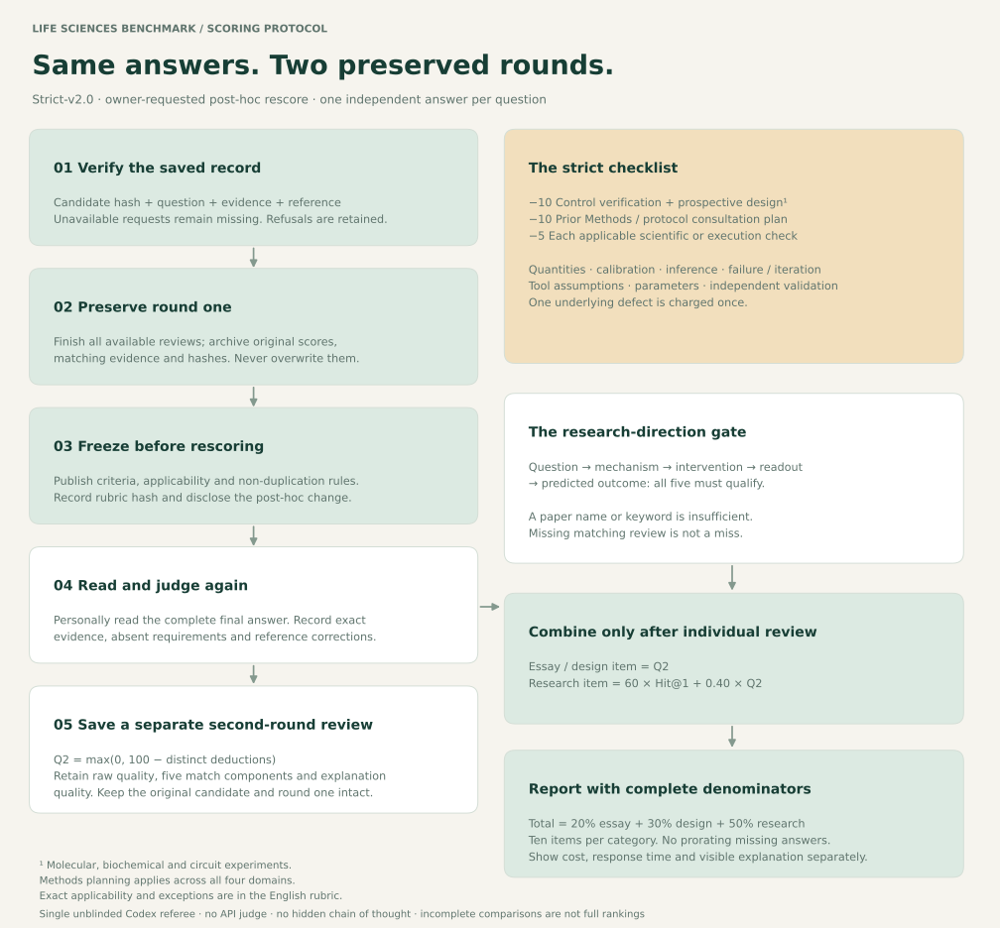

# Strict second-round scoring

The canonical final rubric is [strict-v2.1-public](../benchmark-30/v2/RUBRIC.md). It preserves the scientific criteria, deductions and applicability frozen in strict-v2.0, while updating the completed first-round coverage, public-release policy and reference provenance.

- [Final rubric and scoring formula](../benchmark-30/v2/RUBRIC.md)
- [Question-level applicability](../benchmark-30/v2/applicability.json)
- [All 30 questions, with links to both reference versions](../benchmark-30/QUESTIONS.md)
- [Reference corrections](../benchmark-30/v2/REFERENCE-CHANGES.md)
- [Frozen input checksums](../benchmark-30/v2/INPUT-FREEZE.json)
- [Rescoring status](../benchmark-30/STATUS.md)
- [Archived strict-v2.0 text](../benchmark-30/v1/strict-v2.0-prefreeze.md)

The same saved answers are read again; candidate and judge APIs are not called. Research scores retain 60% qualified historical-direction Hit@1 and 40% scientific quality. Overall category weights remain 20/30/50.

The diagram's strict-v2.0 label identifies the frozen scientific workflow, which is unchanged in strict-v2.1-public. Reference answers and historical targets were subsequently authorized for publication by the owner. Original credentials and raw provider records remain private.
