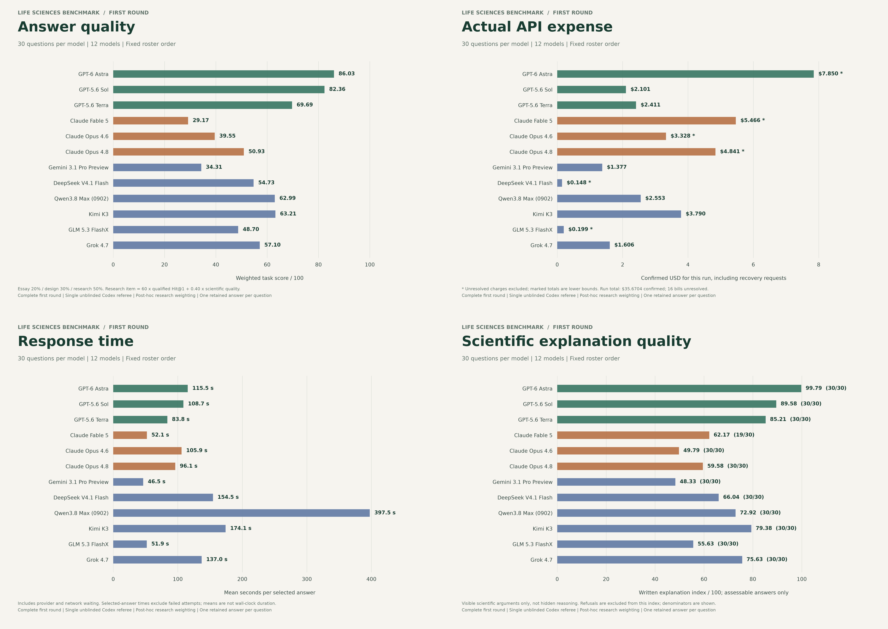

# First-round results

**Complete: 12 models x 30 questions = 360 reviewed responses.** This is the original scoring round, retained separately from the forthcoming strict second-round rescore. Exported 4 October 2026 (Asia/Shanghai); evaluation records are dated 3 October 2026 UTC.

Each model answered ten essays, ten experimental-design questions and ten research-reasoning questions. Category means are weighted **20% / 30% / 50%**. Each research item is **60 x qualified historical-direction Hit@1 + 0.40 x scientific quality**. This weighting was requested after inspection of some answers and is post-hoc. The first-round quality rubric is unchanged.

Eight interrupted requests were each resubmitted once with explicit owner authorization. One answer per slot is retained; there was no best-of selection. Original interrupted records and immutable first-round reviews remain archived privately. No valid refusal was retried.

## Scores

| Model | Overall /100 | Essay | Design | Research | Direction hits /10 |
|---|---:|---:|---:|---:|---:|
| GPT-6 Astra | 86.03 | 100.00 | 98.00 | 73.25 | 6/10 |
| GPT-5.6 Sol | 82.36 | 96.25 | 87.13 | 73.95 | 7/10 |
| GPT-5.6 Terra | 69.69 | 91.50 | 80.63 | 54.40 | 4/10 |
| Kimi K3 | 63.21 | 85.00 | 76.63 | 46.45 | 3/10 |
| Qwen3.8 Max (0902) | 62.99 | 81.75 | 63.13 | 55.40 | 5/10 |
| Grok 4.7 | 57.10 | 85.25 | 69.00 | 38.70 | 2/10 |
| DeepSeek V4.1 Flash | 54.73 | 78.50 | 62.00 | 40.85 | 3/10 |
| Claude Opus 4.8 | 50.93 | 68.25 | 55.00 | 41.55 | 3/10 |
| GLM 5.3 FlashX | 48.70 | 65.25 | 50.25 | 41.15 | 3/10 |
| Claude Opus 4.6 | 39.55 | 60.13 | 48.00 | 26.25 | 1/10 |
| Gemini 3.1 Pro Preview | 34.31 | 58.50 | 42.88 | 19.50 | 0/10 |
| Claude Fable 5 | 29.17 | 59.38 | 25.25 | 19.45 | 1/10 |

## Cost, time and explanation quality

| Model | Confirmed run cost (USD) | Unresolved bills | Mean selected-answer time | Explanation /100 | Assessable |
|---|---:|---:|---:|---:|---:|
| GPT-6 Astra | $7.8503 | 1 | 115.5 s | 99.79 | 30/30 |
| GPT-5.6 Sol | $2.1014 | 0 | 108.7 s | 89.58 | 30/30 |
| GPT-5.6 Terra | $2.4111 | 0 | 83.8 s | 85.21 | 30/30 |
| Claude Fable 5 | $5.4660 | 10 | 52.1 s | 62.17 | 19/30 |
| Claude Opus 4.6 | $3.3280 | 1 | 105.9 s | 49.79 | 30/30 |
| Claude Opus 4.8 | $4.8406 | 1 | 96.1 s | 59.58 | 30/30 |
| Gemini 3.1 Pro Preview | $1.3775 | 0 | 46.5 s | 48.33 | 30/30 |
| DeepSeek V4.1 Flash | $0.1475 | 2 | 154.5 s | 66.04 | 30/30 |
| Qwen3.8 Max (0902) | $2.5534 | 0 | 397.5 s | 72.92 | 30/30 |
| Kimi K3 | $3.7896 | 0 | 174.1 s | 79.38 | 30/30 |
| GLM 5.3 FlashX | $0.1985 | 1 | 51.9 s | 55.63 | 30/30 |
| Grok 4.7 | $1.6064 | 0 | 137.0 s | 75.63 | 30/30 |

**Confirmed run total: $35.6704; 16 bills remain unresolved.** Costs include known charges for original interrupted calls and authorized recovery submissions. Unknown charges are excluded, not assumed to be zero. These figures are separate from account-wide usage and budget reservations. No candidate or grading API calls were made to produce this export.

Selected-request times sum to 12.70 hours; this is not elapsed wall-clock time because requests ran concurrently. Per-model means include network/provider waiting and exclude interrupted attempts.

Claude Fable 5 has 11 empty valid refusals, which receive zero task performance and no explanation index. Two additional partial answers were graded for their actual content. Its explanation mean therefore uses 19/30 answers; all other models use 30/30. Written scientific-explanation scores evaluate visible arguments, not hidden chain of thought.

## Figures

Green identifies OpenAI models, copper identifies Anthropic models, and slate blue identifies the other providers. This is a display convention only. Every chart uses the same fixed roster order. Heatmap color encodes score instead of provider.

[Scalable SVG](common_score.svg)

[Scalable SVG](common_cost_confirmed_usd.svg)

[Scalable SVG](common_mean_response_seconds.svg)

[Scalable SVG](explanation_mean.svg)

[Scalable SVG](four-metric-overview.svg)

[Scalable SVG](reviewed-item-scores.svg)

## Method and limitations

The project owner carefully reviewed all 30 questions and reference answers, confirmed on 3 October 2026. Candidate scoring is a single, unblinded Codex assessment against the supplied questions, evidence and references. Question review does not imply independent expert certification of candidate grades. Model names are the recorded run labels.

The quality score weights scientific accuracy 35%, decision value 25%, actionability 20%, verifiability 15%, and communication 5%. A historical hit requires the biological question, mechanism, intervention, readout and predicted outcome to jointly match the sealed follow-up target without a critical control or inference failure. Alternative research directions may be scientifically useful without matching that historical target.

These are exploratory written-answer results on a small question set. They do not establish successful laboratory experiments, executed raw-data reproduction, general model superiority or independent inter-rater reliability. Candidate browsing and tools were disabled. The forthcoming strict second round will reuse the same saved answers and be published separately as the final scoring version.

Download [model metrics](model-summary.csv), [question score matrix](item-scores.csv), or [aggregate JSON](summary.json). Private candidate text, reference answers and individual grading records are not published.
