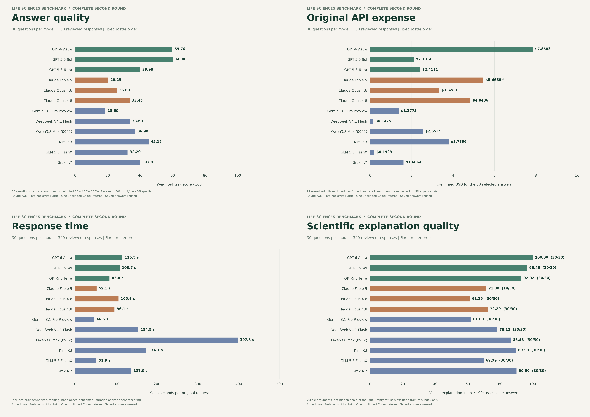
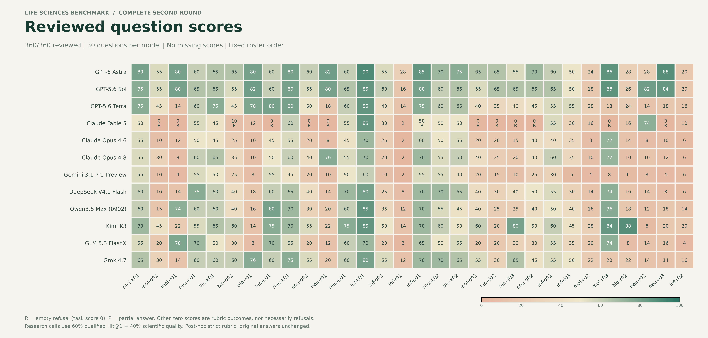

# Complete second-round scorecard

Completed 2026-10-04T09:00:57.820449+00:00. All **360/360** selected answers have been personally reviewed: 12 models, 30 questions each, ten per category. One retained answer per question; eight first-round missing answers used the previously authorized recovery submissions. No candidates were regenerated for round two.

**Scoring:** 20% essay mean + 30% experimental-design mean + 50% research-reasoning mean. Each research item is 60 points for a qualified five-component historical-direction Hit@1 plus 40% of its strict scientific-quality score. A valid alternative direction can earn quality credit while missing the historical continuation.

Both the strict rubric and the direction weighting are post-hoc. These are complete results for this set, not a universal model ranking or an independent human-panel evaluation. Model order follows the frozen roster.

| Model | Essay | Design | Research | Total /100 | Historical hits /10 | Round one | Change |
|---|---:|---:|---:|---:|---:|---:|---:|
| GPT-6 Astra | 72.50 | 60.00 | 54.40 | **59.70** | 5 | 86.03 | -26.33 |
| GPT-5.6 Sol | 70.00 | 59.00 | 57.40 | **60.40** | 6 | 82.36 | -21.96 |
| GPT-5.6 Terra | 71.50 | 45.00 | 24.20 | **39.90** | 1 | 69.69 | -29.79 |
| Claude Fable 5 | 50.00 | 12.50 | 13.00 | **20.25** | 1 | 29.17 | -8.92 |
| Claude Opus 4.6 | 53.00 | 25.00 | 15.00 | **25.60** | 1 | 39.55 | -13.95 |
| Claude Opus 4.8 | 60.00 | 34.50 | 22.20 | **33.45** | 2 | 50.92 | -17.47 |
| Gemini 3.1 Pro Preview | 52.00 | 17.00 | 6.00 | **18.50** | 0 | 34.31 | -15.81 |
| DeepSeek V4.1 Flash | 67.50 | 36.00 | 18.60 | **33.60** | 1 | 54.73 | -21.12 |
| Qwen3.8 Max (0902) | 64.50 | 34.00 | 27.60 | **36.90** | 2 | 62.99 | -26.09 |
| Kimi K3 | 67.50 | 52.50 | 31.80 | **45.15** | 2 | 63.21 | -18.06 |
| GLM 5.3 FlashX | 60.00 | 28.00 | 23.60 | **32.20** | 2 | 48.70 | -16.50 |
| Grok 4.7 | 66.50 | 50.00 | 23.00 | **39.80** | 1 | 57.10 | -17.30 |

## Original generation metrics

These costs and request latencies belong to the original selected answers, not rescoring. Second-round candidate/judge API expense is **$0**. Costs exclude earlier interrupted/unselected requests; unresolved selected charges are flagged. Mean request latency includes provider/network waiting and is not total elapsed benchmark time.

| Model | Selected confirmed cost (USD) | Unresolved bills | Mean request seconds | Written explanation /100 (n/30) | Empty refusals |
|---|---:|---:|---:|---:|---:|
| GPT-6 Astra | 7.8503 | 0 | 115.5 | 100.00 (30/30) | 0 |
| GPT-5.6 Sol | 2.1014 | 0 | 108.7 | 96.46 (30/30) | 0 |
| GPT-5.6 Terra | 2.4111 | 0 | 83.8 | 92.92 (30/30) | 0 |
| Claude Fable 5 | 5.4660 | 10 | 52.1 | 71.38 (19/30) | 11 |
| Claude Opus 4.6 | 3.3280 | 0 | 105.9 | 61.25 (30/30) | 0 |
| Claude Opus 4.8 | 4.8406 | 0 | 96.1 | 72.29 (30/30) | 0 |
| Gemini 3.1 Pro Preview | 1.3775 | 0 | 46.5 | 61.88 (30/30) | 0 |
| DeepSeek V4.1 Flash | 0.1475 | 0 | 154.5 | 78.12 (30/30) | 0 |
| Qwen3.8 Max (0902) | 2.5534 | 0 | 397.5 | 86.46 (30/30) | 0 |
| Kimi K3 | 3.7896 | 0 | 174.1 | 89.58 (30/30) | 0 |
| GLM 5.3 FlashX | 0.1929 | 0 | 51.9 | 69.79 (30/30) | 0 |
| Grok 4.7 | 1.6064 | 0 | 137.0 | 90.00 (30/30) | 0 |

Written-explanation quality assesses visible factual, evidential, causal and alternative/limit reasoning, not private chain-of-thought. Empty refusals score zero for task performance and have no assessable explanation index; partial answers are graded as returned.

## Files and verification

- [Model metrics](model-summary.csv)
- [All 360 item scores](item-scores.csv)
- [Validation report](VALIDATION.json)

All selected candidate hashes, original-round review hashes, frozen question/reference/rubric hashes, exact quotation anchors, applicable-check coverage and score calculations passed validation. The complete first-round archive was verified. Before/after review corrections remain in the private round-two review-amendments folder.

Original questions and v1 references were carefully reviewed by the project owner. The revised v2 references were checked by Codex and still await owner review. Written plans do not demonstrate successful laboratory work or executed raw-data reproduction.

**Final figures are now available:** six visually checked 300 DPI PNG figures, SVG/PDF copies and a combined PDF. Original first-round images are retained separately.

[All 30 questions](../../benchmark-30/QUESTIONS.md) | [Final rubric](../../benchmark-30/v2/RUBRIC.md) | [Revised references](../../benchmark-30/v2/reference-bank.json) | [First-round archive](../first-round-20261003/SCORECARD.md)

## Figures

[PDF collection](second-round-figure-collection.pdf) | [SVG overview](four-metric-overview.svg)
